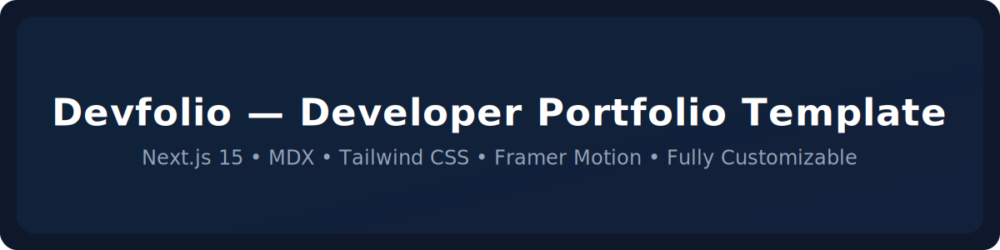

<p align="center">
  
  
  
  
  
  
</p>


## **Devfolio - Developer Portfolio Template (Next.js 15 + MDX + Tailwind)**

A modern, customizable developer portfolio built with **Next.js 15, Tailwind CSS, MDX, and Framer Motion**.
Designed and customized by **Amelia R. Trevino** — now available as an open-source template for anyone to use, modify, and deploy.

🔗 **Live Demo:** [https://devfolio-templete.vercel.app](https://devfolio-templete.vercel.app/)

📦 **Tech Stack:** Next.js 15 • TypeScript • TailwindCSS • MDX • Framer Motion • Resend Email API

---


## **Features**

* **Beautiful, modern portfolio design** with animations and smooth UX
* **Fully responsive** across all devices
* **Dynamic Projects section** powered by `src/contents/projects.ts`
* **Dynamic Blog system** using:
  * MDX files stored in `/src/contents/posts`
  * Blog metadata stored in your .mdx files
* **Automatic routing for blog posts** (`/blogs/[slug]`)
* **Customizable site information** through one config file: `src/config/siteConfig.ts`
* **Configurable Theme Presets** — choose from 8 built-in color themes directly in  
  `src/config/siteConfig.ts` (`blue`, `green`, `purple`, `pink`, `orange`, `red`, `yellow`, `teal`)
* **Advanced theme customization** — edit or create new palettes in  
  `src/config/themePresets.ts`
* **Dark & Light mode theme toggle** with customizable color palette
* **Contact form integrated with Resend API**
* **Easy to extend, easy to deploy** (free deployment with Vercel)
* **Clean folder structure** ideal for beginners and scalable for advanced users

---
## 📘 Documentation

- **Configuration Guide** → [docs/site-config.md](./docs/site-config.md)
- **Customization Guide** → [docs/customization.md](./docs/customization.md)
- **Blog Writing Guide** → [docs/blog-mdx-guide.md](./docs/blog-mdx-guide.md) 
---


## 🏁 **Getting Started**

###  **Option 1 — Use This Template (Recommended)**

This repository is published as a **GitHub Template**.

If you're building **your own portfolio**, this is the fastest way to get started:

1. Click **“Use this template”** on GitHub
2. Create your own repository from the template
3. Clone your new repository:

```bash
git clone https://github.com/<your-username>/<your-repo-name>.git
cd <your-repo-name>
````

4. Install dependencies and start the dev server:

```bash
npm install
npm run dev
```

---

### Option 2 — Clone This Repository

You can also clone this repository directly if you just want to explore the code or experiment locally:

```bash
git clone https://github.com/Mela13076/devfolio-templete.git
cd devfolio-templete
npm install
npm run dev
```

You do **not** need to fork this repository unless you plan to contribute changes back.

If you’d like to **fix bugs**, **suggest features**, or **submit a pull request**, please see
[CONTRIBUTING.md](./CONTRIBUTING.md).


## ⬆️ **Update Your Site Configuration**
>This template uses a **content-driven approach**.
>You only edit simple `.ts` files and `.mdx` files — no need to touch React components.

All global website settings are stored in:

```
src/config/siteConfig.ts
```

You can edit:
* name & tagline
* social links
* navigation menu
* footer text
* about content

The website will automatically update everywhere after modifying this file.

### 🎨 **Customization — Theme Presets & Colors**
---

This template includes 8 customizable **theme presets** you can switch between in `src/config/siteConfig.ts`:
```
siteColorTheme: "teal"
```


Available presets:
```
blue • green • purple • pink • orange • red • yellow • teal
```

To modify or add new themes, edit:
```
src/config/themePresets.ts
```

Each theme controls the full color system (accent, hover, borders, backgrounds, etc.).


### 🧩 Adding Projects
---

Projects are stored here:

```
src/contents/projects.ts
```

Each project takes a typed object (types are optional & documented in `src/types/index.ts`):

```ts
{
  title: "My Cool Project",
  description: "...",
  tags: ["Next.js", "TypeScript"],
  demoUrl: "https://...",
  codeUrl: "https://..."
}
```


### 📚 Adding Blog Content (MDX)
---
All blog content in Devfolio is powered by MDX and uses the file system as the single source of truth.

Blog post live here:

```
src/contents/blogs/
```

Each blog must be a its own unique `.mdx` file:
The filename becomes the blog slug
```
/src/contents/posts/my-first-post.mdx
```
### Metadata

At the top of the MDX file, include metadata. 

**Required fields**
* `title` – string
* `summary` – string (used for blog cards)
* `date` – string (ISO format recommended)

**Optional fields**
* `tags` – string[]
* `readTime` – string
* `lastUpdated` – string

Example:

```mdx
---
title: "My First Post"
summary: "A short summary of the blog post."
date: "2025-01-01"
tags: ["Career", "Education"]
readTime: "6 min read"
lastUpdated: "2025-05-01"
---

# My First Post

Your article content goes here.  
MDX allows you to mix Markdown with React components.
```


### How Blogs Are Generated

* Blog metadata is **automatically extracted** from MDX frontmatter
* Blog cards and blog pages are generated at **build time**
* No manual blog list or config file is required
* Invalid or missing metadata will throw a **helpful error during build**

🔹 **Important notes**

* Every blog must have its own `.mdx` file
* Do not manually add blog metadata anywhere else


## ✉️ **Contact Form Setup (Resend API)**

>**Contact form is optional to use**

The contact form sends emails through **Resend**.

 1. Create a free Resend account
    - ➡ [https://resend.com](https://resend.com)
 2. Create an API key
 3. Add an `.env` file:

```
RESEND_API_KEY=your_resend_key_here
```
 4. Configure your Resend data in `src/config/siteConfig.ts`
```
resend: {
        fromEmail: "", 
        toEmail: "",
    },
```
 4. Your route is already set up here:

```
src/app/api/contact/route.ts
```
* no changes needed in this file

The form will work automatically once the API key is configured.


## ☁️ **Deployment (Vercel)**

1. Commit and push your code to GitHub

2. Go to Vercel → "New Project"

3. Select your GitHub repo

4. Add environment variables if using Contact Form (important!) 
```
RESEND_API_KEY=your_resend_key_here
```
5. Deploy
    - Vercel will automatically handle build, routing, and optimization.


## 🗂 **Recommended Folder Structure**

```
src/
 ├── app/
 │    ├── page.tsx
 │    ├── globals.css
 │    ├── layout.tsx
 │    ├── about/
 │    ├── projects/
 │    ├── blogs/
 │    ├── contact/
 │    └── api/contact/route.ts
 ├── components/
 ├── contents/
 │    ├── projects.ts
 │    └── blogs/
 ├── config/
 │    ├── siteConfig.ts
 │    └── themePresets.ts
 ├── types/
 ├── utils/
 └── lib/
 
```


## 🛠 **Technologies Used**

* **Next.js 15 (App Router)**
* **React + TypeScript**
* **TailwindCSS**
* **Framer Motion**
* **MDX**
* **Resend API**
* **Vercel Deployment**


## 📄 **License**

[MIT Licence](./LICENSE)

This project is open-source and free for personal or commercial use.

If you use it, ⭐ **please consider giving the repo a star!**
It helps others discover the template and supports its development.


## 🤝 **Contributing**

If you would like to suggest improvements to the original template, you have several options:

### 💡 Feature Suggestions or Bug Reports
Create a new **Issue** using the Bug Report or Feature Request templates.

### 💬 Discussions
Join the conversation in the **Discussions** tab to ask questions, share ideas, or request enhancements.

### 🔧 Contribute via Pull Request
If you'd like to directly contribute to the project:
1. Read the [`CONTRIBUTING.md`](./CONTRIBUTING.md) file  
2. Create a new branch  
3. Submit a pull request  

All contributions are welcome — from small fixes to major improvements!


## 🙌 **Acknowledgements**

Designed and built by **Amelia R. Trevino**.
Made open-source to help developers build beautiful, production-ready portfolios fast.


